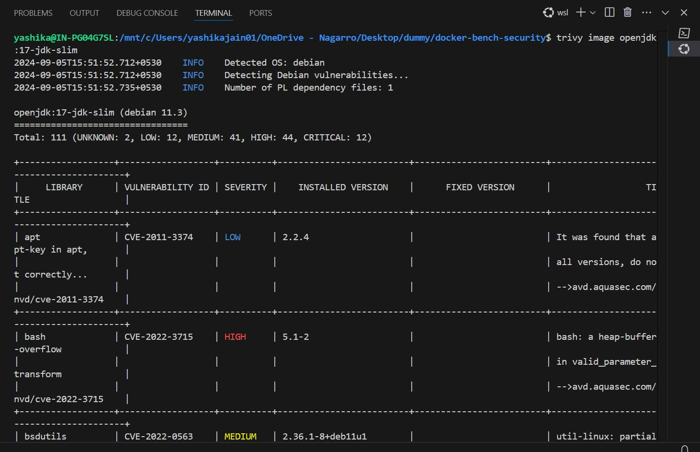
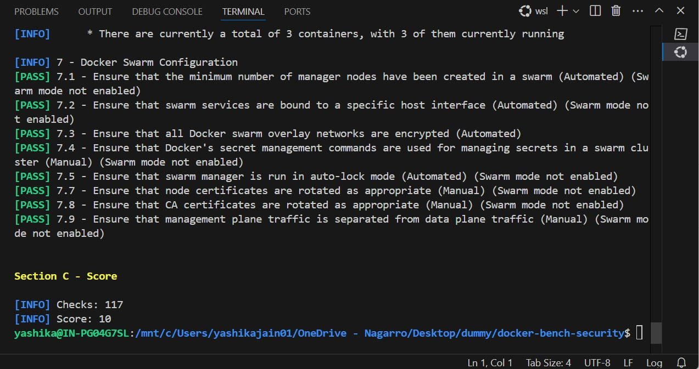

# Docker Assignment 2

## Description
* Docker assignment 2 according to the assignment I have used 2 existing Java Spring Boot services dockerfile. One is just a static service that provides a list of users and a welcome message. The second uses a MySQL database. Using the APIs of microservice B, we can create and read users.
* To deploy these containers I have used docker volume and network so that containers can comunicate with each other.
* Previously both the images are around 600MB now I reduced them to around 400MB.
* Previouly image build was taking around 150 sec's but now I have used docker cache due to which it got recude 19 sec after 1st build.(Only for first time build it will take more time depending on your internet speed to download the dependencies).

## Requirements
- Postman
- Docker
- Docker Compose
- Git
- Any IDE (Optional)


## Developer Instructions
#### To run the application, follow the instructions below:

1. create a network for container communication
```bash
docker network create docker-assignment
```
2. Create a volume for database
```bash
docker volume create mysql_data
```

3. Deploy mysql database
```bash
docker run -d --name mysql-app  --network docker-assignment -p 3315:3306   -e MYSQL_DATABASE=db -e MYSQL_USER=spring_root -e MYSQL_ROOT_PASSWORD=random@PasswordComb1nA@Ti0n  --volume mysql_data:/var/lib/mysql  mysql:8.0  mysqld --default-authentication-plugin=mysql_native_password
```
4. Depoly Microservice A
```bash
docker run -d --name spring-app-microservice-a --network docker-assignment -p 8080:8080 --memory 256m yashika1410/docker-2-microservice-a
```

5. Deploy Microservice B
```bash
docker run -d --name spring-app-microservice-b --network docker-assignment -p 8082:8080 -e DB_USERNAME=root -e DB_PASSWORD=random@PasswordComb1nA@Ti0n -e DB_URL=jdbc:mysql://mysql-app:3306/db --memory 256m yashika1410/docker-2-microservice-b
```

6. Check Status of containers
```bash
docker ps
```

#### If you want to check the code or build the image locally.
1. clone repository

```bash
git clone https://github.com/Yashika1410/Docker.git
cd Docker/assignment-2
```
2. build image
```bash
cd microservice-a
docker build -t <docker-hub-username>/docker-2-microservice-a
cd ../microservice-b
docker build -t <docker-hub-username>/docker-2-microservice-b
```
3. follow the above steps to deploy the images 
4. to backup the mysql database voluse use given below command
```bash
docker run --rm -v mysql_data:/var/lib/mysql -v $(pwd):/backup ubuntu tar czvf /backup/mysql_data_backup.tar.gz -C /var/lib/mysql .
```

### Reports
##### trivy Vulnerability report

#### Docker Bench security Report

