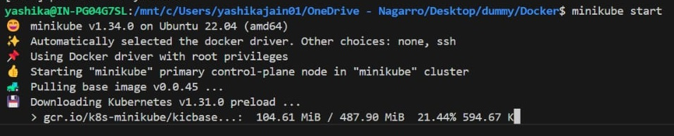
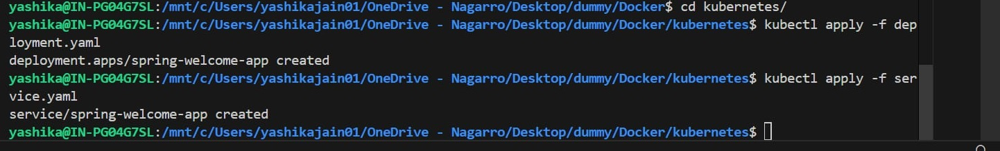
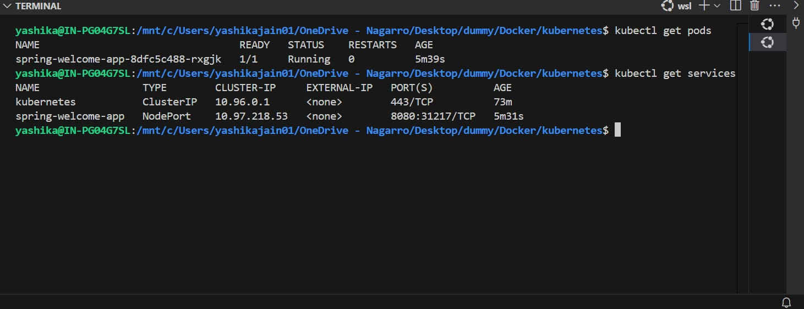
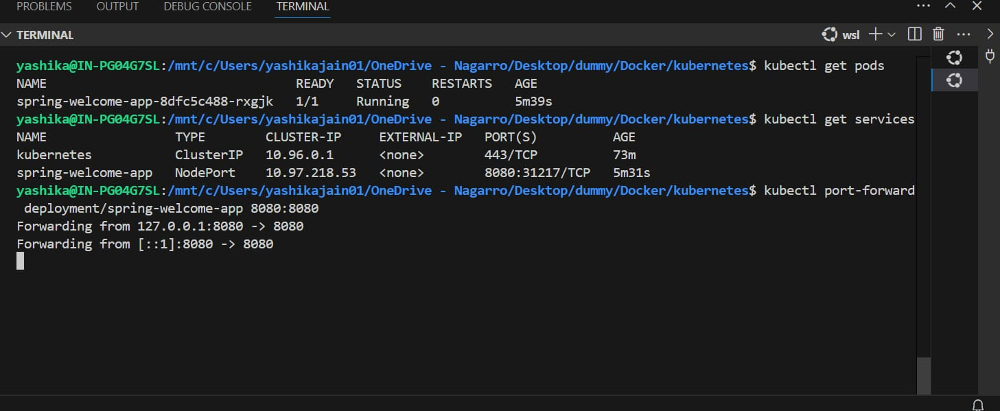
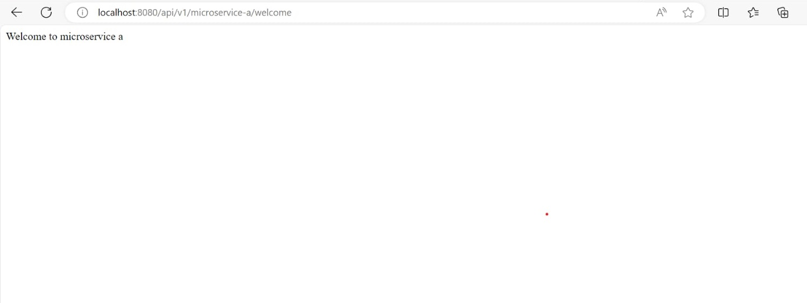

# Kubernetes Assignment

## Description
* Create a spring boot application
* To deploy this Service. I have used kind cluster.
* As per instructions I also tried readiness and proness.

## Requirements
- Postman
- Docker
- minikube
- kubectl
- Git
- Any IDE (Optional)

## Developer Instructions
#### To run the application, follow the instructions below:
1. Start minikube cluster
```bash
minikube start
```

2. After creation of cluster now clone this repository
```bash
git clone https://github.com/Yashika1410/Docker.git
cd Docker/kubernetes
```
3. now using deployment.yaml create the pods
```bash
kubectl apply -f deployment.yaml
```
4. Apply service.yaml to create service
```bash
kubectl apply -f service.yaml
```


5. Check the pods and services
```bash
kubectl get pods
kubectl get services
```


6. To test the application we need to port forward the cluster port to local port
```bash
kubectl port-forward deployment/spring-welcome-app 8080:8080
```


7. Now you can test the application using this [url](http://localhost:8080/api/v1/microservice-a/welcome)


8. if you wish to increase the replicass then run given below command
```bash
kubectl scale deployment spring-welcome-app --replicas=3
```
